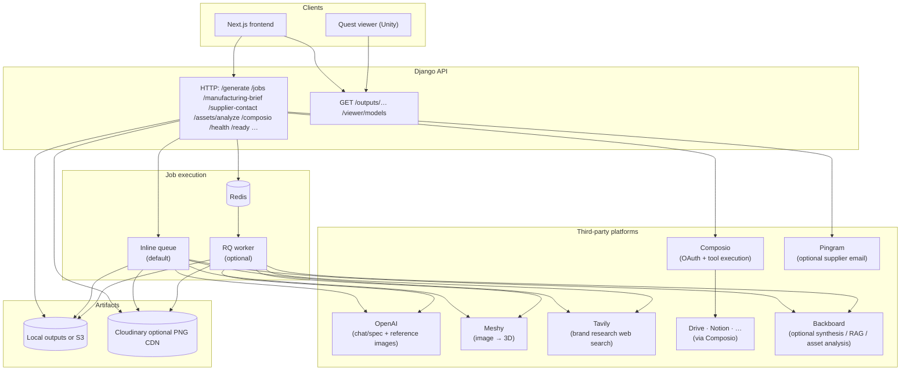

# Artifex

Artifex turns a short product idea into a **structured spec**, **brand research**, **reviewable concept reference images**, and—after you confirm—**image-to-3D meshes** (Meshy) plus supporting assets. A Next.js UI drives the flow; a Django API owns jobs, storage, and integrations.



Typical artifacts under `outputs/{job_id}/` include `spec.json`, concept PNGs, `reference_front.png`, optional `model.glb` / STL / OBJ (depending on requested formats), and `preview.png` when Meshy provides one.

## Manufacturing, cost projection, and platform integration

After a run **completes**, you can request a **manufacturing brief** (`POST /jobs/{job_id}/manufacturing-brief`): an LLM-backed outlook grounded in the company context, uploaded documents, research digest, and `spec.json`. For physical products it emphasizes processes, a BOM-style breakdown, rough **cost bands** (tooling, unit or marginal, MOQ notes), and practical supplier next steps; for software-heavy or hybrid ideas it reframes the same structure around engineering milestones, hosting or run costs, and GTM channels. Results are cached on the job as `manufacturing_plan`. The JSON body may include optional `company_context`, and `refresh: true` to rebuild even when a plan already exists.

With **`PINGRAM_API_KEY`** configured on the server, **`POST /jobs/{job_id}/supplier-contact`** sends a supplier outreach email (subject, body, recipient) via [Pingram](https://www.pingram.io/) from the manufacturing flow in the UI.

**Platform integration** (Composio) is optional: with `COMPOSIO_API_KEY` and allowed toolkits configured, users can connect OAuth apps and pull files or pages from tools such as **Google Drive** and **Notion** into the same context-documents path as manual uploads—see `/composio/*` routes in the API summary below.

## What it does

Artifex runs an end-to-end pipeline from idea to prototype:

- **Context in** — Users provide a company, the product idea, and documents (uploads). Optional Composio hooks pull additional context from tools like Google Drive and Notion into the same “context documents” flow.

- **Brand-grounded research** — With Tavily (and optional Backboard for synthesis / search), the system gathers web-grounded brand and product signals, then produces a research digest (and sources) tuned for downstream concept imagery, not generic marketing fluff.

- **Human-in-the-loop before pixels** — Users can review and edit the research digest (and related brief fields) so enterprise facts and tone stay accurate and on-brand before any expensive generation.

- **Concept “sketches”** — The system generates reference concept images (canonical front view plus a three-quarter view derived from the front so geometry stays consistent), using the idea, company, documents, and research.

- **Stakeholder-ready 3D** — After concept confirmation, Artifex runs Meshy image-to-3D and exports formats such as GLB (plus STL/OBJ/etc. as configured). The web app uses `model-viewer` for an interactive spin-and-inspect experience. A Unity Quest viewer path in the repo supports XR / hand interaction for “see and touch” demos.

Outputs are organized per job (`spec.json`, previews, meshes) with a clear API for async jobs, regeneration, and cancellation—closer to how real innovation workflows behave than a single-shot toy demo.

## How I built it

- **Backend:** Django orchestrates jobs, storage (local or S3), optional Redis/RQ workers, and external APIs (OpenAI for images/chat as configured, Tavily, Meshy, Backboard, Composio, Pingram for supplier email when configured).

- **Frontend:** Next.js / React drives the job lifecycle, research review, concept review, format selection, and 3D preview via `model-viewer`.

- **Pipeline design:** Deliberate pause points (`awaiting_concept_confirmation`, research → image prompt preview) so enterprise users stay in control—critical when strategy docs and brand risk matter.

- **Optional XR:** Unity + Meta XR tooling (`quest-viewer`) for loading and interacting with prototypes beyond the flat screen.

## What’s in this repo

| Area | Role |
|------|------|
| [`backend/`](backend/) | Django API, job queue, Meshy/OpenAI/Tavily/Composio/Backboard wiring |
| [`frontend/`](frontend/) | Next.js 14 app with `model-viewer` for in-browser GLB preview |
| [`quest-viewer/`](quest-viewer/) | Optional Unity 6 Meta Quest client; see [`quest-viewer/README.md`](quest-viewer/README.md) |

## Stack

- **Backend:** Django 5.2, Pydantic 2, optional Redis + RQ for async work  
- **Frontend:** Next.js 14.2, React 18, TypeScript  
- **Artifacts:** Local disk by default (`outputs/`), optional S3; optional Cloudinary for PNG CDN URLs  

## Prerequisites

- Python 3.x (use a venv)  
- Node.js 18+ for the frontend  
- API keys as needed: see [`.env.example`](.env.example) (OpenAI for chat/spec; OpenAI image API for reference frames; Meshy for 3D; optional Tavily, Composio, Backboard, Cloudinary, Pingram)  

The backend loads **`.env` at the repository root** first, then optional `backend/.env` for any keys still unset ([`backend/app/config.py`](backend/app/config.py)).

```bash
cp .env.example .env
```

Edit `.env` before running workers or hitting paid APIs.

## Run the backend

```bash
cd backend
python3 -m venv .venv
source .venv/bin/activate   # Windows: .venv\Scripts\activate
pip install -r requirements.txt
python manage.py migrate --noinput
python manage.py runserver 0.0.0.0:8000
```

- App URLs are mounted at the server root (no `/api` prefix): e.g. `http://localhost:8000/health`  
- Static downloads: `GET /outputs/{job_id}/{filename}`  

### Optional: Redis + RQ worker

Default: `QUEUE_BACKEND=inline` (work runs in the web process). For a separate worker:

**Terminal A** (API with RQ):

```bash
cd backend
source .venv/bin/activate
QUEUE_BACKEND=rq REDIS_URL=redis://localhost:6379/0 python manage.py runserver 0.0.0.0:8000
```

**Terminal B** (worker):

```bash
cd backend
source .venv/bin/activate
REDIS_URL=redis://localhost:6379/0 python -m app.worker_runner
```

## Run the frontend

```bash
cd frontend
npm install
NEXT_PUBLIC_API_URL=http://localhost:8000 npm run dev
```

Open [http://localhost:3000](http://localhost:3000).

Optional headers when the API is locked down (`API_AUTH_TOKEN` on the server):

```bash
NEXT_PUBLIC_API_TOKEN=<token>
NEXT_PUBLIC_USER_ID=<user-id>
```

The browser client sends `x-api-token` and `x-user-id` when these are set.

## Pipeline (high level)

1. **`POST /generate`** — Creates a job and enqueues prompt/spec work, optional brand research (Tavily when configured), then pauses for **image-generation preview** review when applicable.  
2. **`POST /jobs/{id}/confirm-image-generation`** — Continues to reference image generation (and downstream steps). **`POST .../save-image-generation-preview`** refreshes the prompt preview from edited research text without leaving that wait state.  
3. After concept images exist, the job waits for **`POST /jobs/{id}/confirm-concept`** to run Meshy (and optional format selection). **`POST .../regenerate-concept`**, **`.../add-concept-style`**, and **`.../select-concept-style`** support iteration while awaiting that confirmation.  
4. **`POST /jobs/{id}/regenerate-3d`** — Re-runs Meshy from the saved front reference after completion or failure.  
5. After **`completed`**, optional **`POST /jobs/{id}/manufacturing-brief`** (cached `manufacturing_plan` on the job) and **`POST /jobs/{id}/supplier-contact`** (Pingram email when configured).

Poll **`GET /jobs/{id}`** (or list **`GET /jobs`**) for status and file URLs. **`DELETE /jobs/{id}`** removes a job and its artifacts.

## HTTP API (summary)

| Method | Path | Purpose |
|--------|------|---------|
| GET | `/health` | Liveness |
| GET | `/ready` | Queue, storage, Composio readiness |
| POST | `/generate` | Start a job |
| GET | `/jobs` | List recent jobs for the authenticated user (`?limit=`) |
| GET | `/jobs/{job_id}` | Job payload |
| DELETE | `/jobs/{job_id}` | Delete job + artifacts |
| POST | `/jobs/{job_id}/confirm-image-generation` | Continue after research / image prompt review |
| POST | `/jobs/{job_id}/save-image-generation-preview` | Rebuild image prompt preview only |
| POST | `/jobs/{job_id}/confirm-concept` | Approve references → Meshy (`target_formats` in JSON body) |
| POST | `/jobs/{job_id}/regenerate-concept` | New reference images while awaiting concept confirmation |
| POST | `/jobs/{job_id}/add-concept-style` | Enqueue an extra style variation |
| POST | `/jobs/{job_id}/select-concept-style` | Pick a generated style index as canonical |
| POST | `/jobs/{job_id}/regenerate-3d` | Re-run Meshy after `completed` / `failed` |
| POST | `/jobs/{job_id}/manufacturing-brief` | LLM manufacturing / cost outlook (`completed` only); body: optional `company_context`, `refresh` |
| POST | `/jobs/{job_id}/supplier-contact` | Send supplier email via Pingram (`completed` only; requires `PINGRAM_API_KEY`); body: `to_email`, `subject`, `message` |
| POST | `/jobs/{job_id}/cancel` | Request cancellation |
| POST | `/assets/analyze` | Multipart reference/sketch analysis → text sections |
| GET | `/viewer/models` | Jobs with `model.glb` (Quest viewer sync; camelCase JSON) |
| GET | `/composio/toolkits` | Allowed toolkits |
| POST | `/composio/connect` | Start OAuth for a toolkit |
| POST | `/composio/disconnect` | Disconnect toolkit |
| POST | `/composio/fetch` | Pull a file/page into context |
| POST | `/composio/drive/browse` | Browse or search Google Drive via Composio |
| GET | `/outputs/...` | Download generated files |

Auth: when `API_AUTH_TOKEN` is set, requests must include `x-api-token` and `x-user-id`. Jobs are scoped to `user_id`.

## Configuration notes

Full variable list and comments live in [`.env.example`](.env.example). Highlights:

- **LLM / spec:** `OPENAI_API_KEY`; optional `OPENAI_BASE_URL`, `OPENAI_MODEL`. Heuristic fallback exists if the LLM call fails or the key is missing.  
- **Reference images:** OpenAI Images API (`gpt-image-1`, DALL·E, etc.). For a split stack (e.g. DeepSeek for chat only), set `IMAGE_OPENAI_API_KEY` + `IMAGE_OPENAI_BASE_URL` to OpenAI—non-OpenAI keys against the images endpoint return 401.  
- **Meshy:** `MESHY_API_KEY` for image-to-3D.  
- **Research:** `TAVILY_API_KEY` enables live web search in brand research; without it, research uses the prompt and uploaded context only.  
- **Storage:** `STORAGE_BACKEND=local|s3`; for S3 set `S3_BUCKET` and optional `S3_REGION` / `S3_PUBLIC_BASE_URL`.  
- **CDN for PNGs:** Optional Cloudinary (`CLOUDINARY_*`); meshes and JSON still follow `STORAGE_BACKEND`.  
- **Composio:** `COMPOSIO_API_KEY` and `COMPOSIO_ALLOWED_TOOLKITS` for pulling Google Drive, Notion, etc. into context documents.  
- **Pingram:** `PINGRAM_API_KEY` (and optional `PINGRAM_BASE_URL`, `PINGRAM_NOTIFICATION_TYPE`) for supplier outreach from completed jobs.  
- **Backboard:** Optional [Backboard](https://docs.backboard.io/) integration—set `ARTIFEX_USE_BACKBOARD=1` plus `BACKBOARD_API_KEY` and the `ARTIFEX_BACKBOARD_*` toggles in `.env.example` (default is off).  

## Error codes

The API may surface structured errors including: `INVALID_SPEC`, `UNSUPPORTED_OBJECT_TYPE`, `GENERATION_FAILED`, `RENDER_FAILED` (exact usage depends on the failing stage—see responses and server logs).

## Quest headset

For loading `model.glb` URLs from this stack on device, use the Unity project under [`quest-viewer/`](quest-viewer/) and its [README](quest-viewer/README.md).
